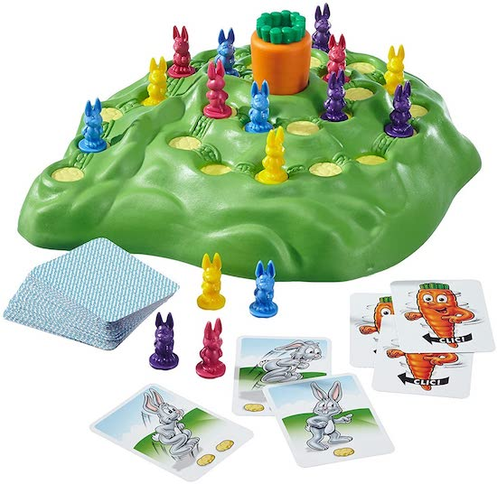

# Create Lotti Karotti Board Game

## What are we currently working on?

1. [X] Create the board
2. [X] Add board#spin
3. [ ] Create the Game Master

## Coding Study

Tool: Plain Ruby

Task: Create Lotti Karotti Board Game

Two players can move figures from start to finish and win or lose.

Purpose: Train OOP - SRP - TDD

